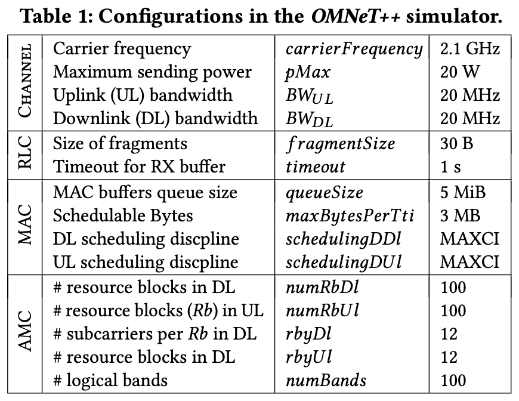

# Vagrant box for simulation with Omnet++ and SimuLTE

A readme for vagrant box with Omnet++ simulation setup for the project.

## Requirements
Vagrant - Tested with version 2.2.4 (available at: https://www.vagrantup.com/downloads.html)

## Vagrant box setup
In the `\vagrant-omnet-simulation-mobility` folder use: 
```bash
$ vagrant up
```

And wait until the vagrant box setup is complete.

## Using the Omnet++ simulator

To access the box and the simulation environment use the following command while remaining in the `\vagrant-omnet-simulation-mobility` folder:

```bash
$ vagrant ssh
```

This will establish an ssh connection to the box. In there you can access the simulation environment.

### Running a simulation

In order to run simulation scenarios (as they were run within the project) switch to the `SimNetwork1/simulations` folder:

```bash
$ cd SimNetwork1/simulations
```

and use the following command to run an exemplary simulation scenario:

```bash
$ ./run_sim_campaign.sh -c swimMovementFP_ds0_p2_s50-50 -t 1
```

This will run a simulation scenario with the name "swimMovementFP_ds0_p2_s50-50".

-c argument specifies the campaign name. You can find what simulation campaigns are available in the `omnetpp.ini` file.

### Simulation settings

The following table shows some of the parameters used to configure the eNodeB in the simulated scenarios:
<p align="left">
  
</p>
